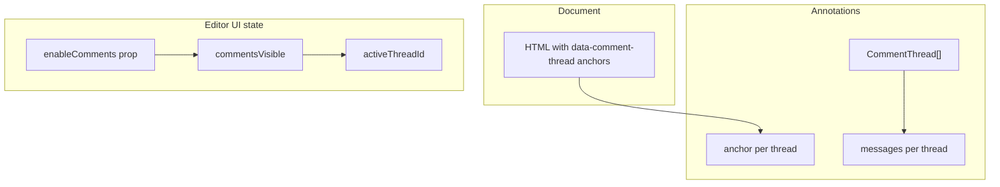
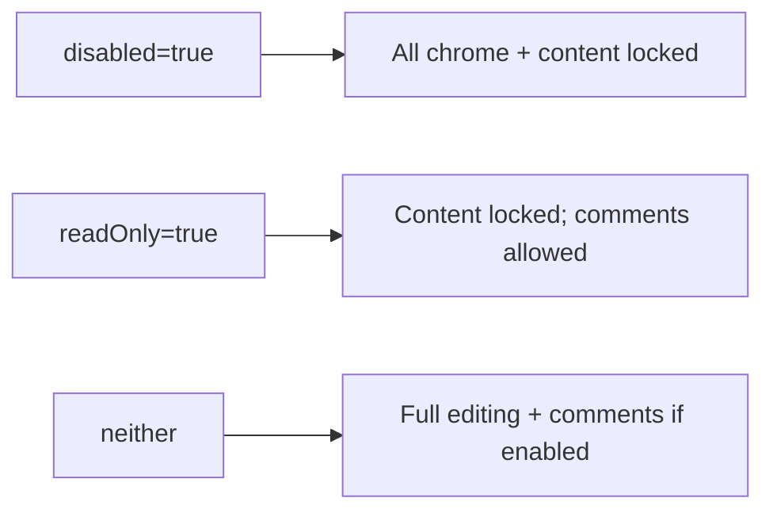

# Implement Comments in the HTML Editor

## Architecture

Three layers stay separate (per spec):



## Data model

New public types in [`src/types.ts`](src/types.ts) (re-exported from [`src/index.ts`](src/index.ts)):

```ts
interface CommentMessage {
  id: string
  userId: string
  userName: string
  message: string
  createdAt: string // ISO-8601 UTC
}

type TextCommentAnchor = {
  type: 'text'
  text: string
  start?: number
  end?: number
  prefix?: string
  suffix?: string
}

type ImageCommentAnchor = {
  type: 'image'
  elementId?: string
  src?: string
}

type CommentAnchor = TextCommentAnchor | ImageCommentAnchor

interface CommentThread {
  id: string
  anchor: CommentAnchor
  messages: CommentMessage[]
  createdAt: string
  resolvedAt?: string | null
  resolvedBy?: string | null
}

type CommentAuthor = { userId: string; userName: string }
```

- Thread IDs: `cmt_${crypto.randomUUID()}` (or existing id-generation pattern if one exists nearby).
- Message IDs: UUID strings.
- `createdAt` / `resolvedAt`: `new Date().toISOString()`.

## New Editor props

Extend [`EditorProps`](src/types.ts) in [`src/components/Editor.tsx`](src/components/Editor.tsx):

| Prop | Default | Role |
|------|---------|------|
| `enableComments` | `false` | Gates all comment chrome + logic |
| `commentAuthor` | — | `{ userId, userName }` required when user posts a message |
| `comments` | — | Controlled thread array |
| `defaultComments` | `[]` | Uncontrolled initial threads |
| `onCommentsChange` | — | `(threads: CommentThread[]) => void` |

**When `enableComments === false`:** no comment module merged into layout, no comment UI, no anchor writes, existing `<Editor />` behavior unchanged.

**State wiring:** mirror [`enableMultiPages`](src/components/Editor.tsx) / `useControllableState` — comment threads are **not** embedded in HTML; `onChange` continues to emit editor HTML (with anchors when threads exist).

## Read-only mode

Comments must work when `readOnly={true}` (e.g. reviewing a versioned/immutable document). Split the current single `locked` flag into two concepts:

| Flag | Meaning |
|------|---------|
| `contentLocked` | `disabled \|\| readOnly` — blocks document text/formatting edits |
| `chromeLocked` | `disabled` only — blocks **all** chrome including comments |



### What works in `readOnly`

- Text/image **selection** (required to target comments) — `contentEditable={false}` still allows selection.
- Comment chrome: Add Comment, Insert → Comment, Show/Hide Comments (when `enableComments`).
- Opening existing threads, posting new messages and replies (when `commentAuthor` is set).
- Comment visibility toggle (UI state only).
- Applying/restoring `data-comment-thread` anchors in the live DOM for highlight + thread association.

### What stays blocked in `readOnly`

- All formatting, insert (non-comment), file save/open, history, table structure, image resize, etc. — existing `readOnly` test expectations for Bold/mode switches remain.
- Comment panel Post button when `disabled` (not when `readOnly` alone).

### `onChange` vs `onCommentsChange` in read-only

To preserve the immutable-document contract:

- **`readOnly`:** comment operations fire **`onCommentsChange` only** — do **not** call `onChange` for anchor-only DOM mutations. Host persists comments separately from the document version HTML.
- **Normal edit mode:** comment anchor writes go through existing `recordHtml` / `recordVisualHtml` and fire both `onChange` (HTML with anchors) and `onCommentsChange`.

On load in read-only, host supplies `value` + `comments`; editor **re-applies anchors** from thread data onto the immutable HTML (new `syncCommentAnchorsToDom(threads, root)` helper in core).

### Lock/query changes

Replace blanket `!locked` on comment queries with `!disabled`:

| Query | Updated rule |
|-------|----------------|
| `canAddComment` | `enableComments && !disabled && visual mode && (hasTextSelection \|\| isImageSelected)` |
| Comment panel Post | enabled when `!disabled && commentAuthor` |

### Toolbar chrome wiring

- Pass `disabled={disabled}` (not `locked`) to `EditorToolbar` **for comment item evaluation**, OR keep `disabled={locked}` globally but give comment catalog items no `enabled` gate that checks lock — instead use `canAddComment` / `areCommentsVisible` queries that ignore `readOnly`.
- Recommended: keep `disabled={locked}` on toolbar for non-comment items; comment items use `enabled: 'canAddComment'` / always-available toggle query that returns true under `readOnly`. Verify `IconNav` / `MenuBar` only apply global `disabled` when `disabled` prop is true — **split toolbar `disabled` prop** into `disabled={disabled}` for global chrome lock and use per-item `enabled` queries for readOnly-aware comment items.

**Concrete approach in `Editor.tsx`:**

```ts
const contentLocked = Boolean(disabled || readOnly)
const chromeDisabled = Boolean(disabled) // comments exempt from readOnly

// VisualSurface: disabled={contentLocked}
// EditorToolbar: disabled={chromeDisabled}  // readOnly leaves toolbar interactive
// canAddComment: !disabled && ...
```

This changes read-only toolbar behavior globally (menus become clickable in readOnly). That is intentional: users need View → Show/Hide Comments and Insert → Comment. Formatting items remain disabled via their existing `enabled: 'isVisualMode'` / command guards that check `contentLocked` inside `commandContext`.

**Command guards:** all non-comment `commandContext` methods that mutate document content must early-return when `contentLocked`. Comment commands check only `disabled`.

## HTML anchors (core)

New module [`src/core/comments/`](src/core/comments/):

| File | Responsibility |
|------|----------------|
| `types.ts` | Internal types (may re-export from `types.ts`) |
| `constants.ts` | `COMMENT_THREAD_ATTR = 'data-comment-thread'` |
| `anchors.ts` | DOM operations |
| `sanitize.ts` | `stripCommentAnchors(html): string` |
| `selection.ts` | `commentTargetAtSelection(root, snapshot)` |

**Text anchors** — follow [`insertBookmarkInDocument`](src/core/bookmark.ts): `splitRangeBoundaries` + `surroundContents` into `<span data-comment-thread="cmt_…">`, fallback insert pattern.

**Image anchors** — set `data-comment-thread` on the selected `` (no wrapper). Snapshot anchor: `src` + optional `id` if present.

**Discovery** — `threadIdAtSelection(root, snapshot)`:
- Image: `selectedImage` / `imageAtSelection` with attribute.
- Text: closest `[data-comment-thread]` ancestor of range, or intersecting marked span.

**Anchor snapshot** at thread creation — use [`snapshotSelection`](src/core/selection.ts) offsets + selected `text`, plus ~20 chars `prefix`/`suffix` from `textContent` for robustness.

**Highlights (visibility only)** — editor chrome class e.g. `.commentAnchor` applied via CSS module on root when `commentsVisible`; attribute stays in DOM when hidden. Toggle `data-comments-visible` on editor root or class on marked elements without touching thread data.

## Sanitized HTML output

Export public utility from [`src/index.ts`](src/index.ts):

```ts
export { stripCommentAnchors } from './core/comments/sanitize'
```

`sanitize.ts` implementation:
1. Parse HTML string (DOMParser in tests; same approach as other core HTML utilities).
2. Remove `data-comment-thread` from all elements.
3. Unwrap `<span>` elements that **only** carried the comment attribute (no `style`, no other attrs) — unwrap inner content, preserve formatting spans.
4. Do **not** strip legitimate spans/images/links/formatting.

Consumers obtain:
- **Editor HTML:** existing `onChange(html)` / `getHtml()` via custom actions.
- **Sanitized HTML:** `stripCommentAnchors(html)`.
- **Comment data:** `onCommentsChange(threads)` / controlled `comments` prop.

Document in README with the spec example (`£150` span removal).

## Commands, queries, and chrome

New feature module [`src/modules/comments/`](src/modules/comments/) following [`src/modules/insert/`](src/modules/insert/):

### Catalog ([`catalog.ts`](src/modules/comments/catalog.ts))

Items (only merged when `enableComments`):
- `addComment` — toolbar Insert group + icon; `enabled: 'canAddComment'`, `command: 'addComment'`
- `toggleCommentsVisible` — toolbar View group + View menu; `toggle: true`, `active: 'areCommentsVisible'`, `command: 'toggleCommentsVisible'`
- `insertComment` — Insert menu; same command as `addComment`, `enabled: 'canAddComment'`

Icons: new `CommentIcon`, `CommentsIcon` (or show/hide variants) in [`src/icons/`](src/icons/).

i18n keys in [`src/i18n/en.ts`](src/i18n/en.ts) and [`src/i18n/es.ts`](src/i18n/es.ts):
- `commandAddComment`, `commandAddCommentAria`
- `showComments`, `hideComments`, `toggleCommentsVisibleAria`
- `commandInsertComment` (Insert menu)
- Comment panel: `commentPanelTitle`, `commentReplyPlaceholder`, `commentPost`, `commentEmpty`

### Layout updates ([`src/toolbar/defaultLayout.ts`](src/toolbar/defaultLayout.ts))

- Insert menu: add `'insertComment'` before `'insertPage'` (or after horizontalRule).
- View menu: add `MENU_SEPARATOR` + `'toggleCommentsVisible'` before preview block.
- Icon groups: add `'addComment'` to insert group; add `'toggleCommentsVisible'` to view group.

### Chrome filtering when disabled

In [`Editor.tsx`](src/components/Editor.tsx), after `mergeCustomActions` + `filterAllowedChrome`:

```ts
const { catalog, layout } = enableComments
  ? mergeCommentsChrome(baseCatalog, baseLayout)
  : { catalog: baseCatalog, layout: baseLayout }
```

Helper `filterCommentsChrome` removes comment item ids from menus/iconGroups when disabled (belt-and-suspenders; primary gate is not merging comments catalog).

**Dynamic Show/Hide label:** in Editor `useMemo`, override `toggleCommentsVisible.labelKey` to `showComments` or `hideComments` based on `commentsVisible` (MenuBar reads static `labelKey` — re-merge item def on toggle).

### Commands ([`commands.ts`](src/modules/comments/commands.ts))

Register in [`src/core/commands.ts`](src/core/commands.ts):

| Command | Behavior |
|---------|----------|
| `addComment` | If selection has existing thread → set `activeThreadId`; else create thread + wrap anchor + open panel |
| `toggleCommentsVisible` | Flip `commentsVisible` UI state only |

| Query | Behavior |
|-------|----------|
| `canAddComment` | `enableComments && !disabled && visual mode && (hasTextSelection \|\| isImageSelected)` — **not** blocked by `readOnly` |
| `areCommentsVisible` | `commentsVisible` |
| `isCommentsEnabled` | `enableComments` (internal) |

### CommandContext extensions ([`src/core/commandTypes.ts`](src/core/commandTypes.ts))

Add comment methods to `CommandContext` implemented in Editor:
- `addComment()`, `toggleCommentsVisible()`, `areCommentsVisible()`, `canAddComment()`
- `getCommentThreads()`, `setCommentThreads()`, `openCommentThread(id)`

## Comment UI

[`src/modules/comments/CommentPanel.tsx`](src/modules/comments/CommentPanel.tsx) + CSS module:

- Portaled panel (pattern from [`ImageResizeOverlay`](src/modules/insert/ImageResizeOverlay.tsx) / [`ChromePortal`](src/chrome/ChromeTheme.tsx)).
- Shown when `activeThreadId` set and `commentsVisible`.
- Lists messages chronologically; each message shows **author name + formatted timestamp + body** (use `Intl.DateTimeFormat` with editor `locale`).
- Reply textarea + Post button; disabled when `disabled` or missing `commentAuthor` — **enabled under `readOnly`**.
- `addMessageToThread(threadId, { userId, userName, message, createdAt })` updates threads via `onCommentsChange`.
- Close/minimize clears `activeThreadId` without deleting data.

Optional: click highlighted anchor opens thread (pointer handler on marked elements when visible).

Stories: [`CommentPanel.stories.tsx`](src/modules/comments/CommentPanel.stories.tsx).

## Editor integration points

In [`Editor.tsx`](src/components/Editor.tsx):

1. `commentsVisible` state (default `true` when comments enabled).
2. `activeThreadId` state.
3. `commentThreads` via `useControllableState`.
4. Wire `commandContext` comment methods.
5. On `addComment`: generate thread, apply anchor in visual DOM, `recordVisualHtml`, append thread with first message if user provides text in panel (or open panel for first message entry — flow: click Add Comment → open panel → user types first message → Post creates thread + message together).
   
   **Refined flow (matches spec):**
   - Add Comment → create `CommentThread` with empty `messages` OR open panel immediately.
   - Spec says: create thread → create first message → associate → display UI. Better UX: create thread + anchor on Add Comment, open panel; first Post adds first message (thread exists with anchor before first message). Alternatively create thread with first message on Post only if we require message text before anchor — spec says open UI for first message entry, so: **create thread + anchor on Add Comment, panel opens for first message; Post adds message to existing thread.**

6. Escape key handler: close comment panel (extend existing dialog escape guard list).
7. `queries` useMemo: include comment queries when enabled.

## Backwards compatibility

- `enableComments` defaults `false`.
- Default catalog merge excludes comments module.
- No new required props for existing consumers.
- `onChange` signature unchanged.
- Comment attrs never written when disabled.

## Tests

| File | Coverage |
|------|----------|
| [`src/core/comments/sanitize.test.ts`](src/core/comments/sanitize.test.ts) | Spec £150 example; nested spans; image attrs; no over-stripping |
| [`src/core/comments/anchors.test.ts`](src/core/comments/anchors.test.ts) | Text wrap, image attribute, unwrap spans |
| [`src/modules/comments/commands.test.ts`](src/modules/comments/commands.test.ts) | Command factory stubs |
| [`src/toolbar/EditorToolbar.test.tsx`](src/toolbar/EditorToolbar.test.tsx) | Chrome absent when disabled; present when enabled; show/hide toggle |
| [`src/components/Editor.test.tsx`](src/components/Editor.test.tsx) | Full flows: disabled defaults, add text/image comment, multi-user thread, visibility toggle preserves data, sanitized output, **readOnly: formatting locked but comment add/reply works, `onChange` not fired for comment ops, `onCommentsChange` fires** |

Use existing helpers: `selectVisualText`, `flushSelectionRefresh`, `userEvent`, `vi.fn()`.

## Documentation

Per [documentation rule](.cursor/rules/documentation.mdc):

1. [`README.md`](README.md) — `enableComments`, `commentAuthor`, `comments`/`onCommentsChange`, `stripCommentAnchors`, data model summary, **readOnly commenting behavior** (`onChange` suppressed, anchor re-sync on load), example.
2. Playground — toggle in [`playground/src/App.tsx`](playground/src/App.tsx), snippet in [`playground/src/codeExamples.ts`](playground/src/codeExamples.ts), copy in [`playground/src/i18n/messages.ts`](playground/src/i18n/messages.ts) (en/es).

## Files changed (summary)

**New:**
- `src/core/comments/*` (types, constants, anchors, sanitize, selection, tests)
- `src/modules/comments/*` (catalog, commands, CommentPanel, stories, tests)
- `src/icons/CommentIcon.tsx` (+ show/hide if needed)

**Modified:**
- [`src/types.ts`](src/types.ts) — props + exported comment types
- [`src/index.ts`](src/index.ts) — exports
- [`src/core/commandTypes.ts`](src/core/commandTypes.ts) — command/query names + context
- [`src/core/commands.ts`](src/core/commands.ts) — merge comment module
- [`src/toolbar/defaultLayout.ts`](src/toolbar/defaultLayout.ts) — layout entries
- [`src/toolbar/defaultCatalog.ts`](src/toolbar/defaultCatalog.ts) — merge comments catalog when enabled (via Editor)
- [`src/components/Editor.tsx`](src/components/Editor.tsx) — state, wiring, panel, chrome gating
- [`src/i18n/en.ts`](src/i18n/en.ts), [`src/i18n/es.ts`](src/i18n/es.ts)
- [`src/icons/index.ts`](src/icons/index.ts)
- Test files listed above
- README + playground docs

## Verification

Run: `npm test`, `npm run lint` (or project equivalents), typecheck — fix any regressions.
