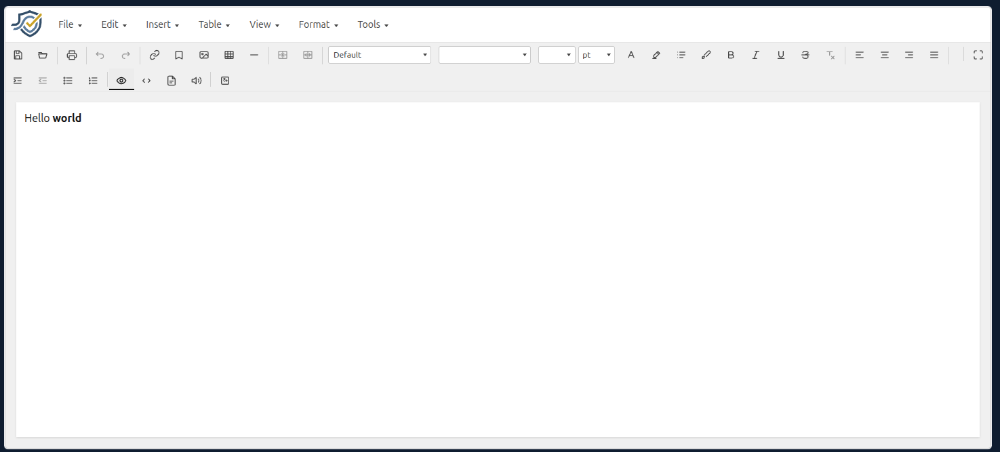

# commspliant-html-editor

> **Beta.** This component is in beta. APIs and behaviour may change.

**Try it out here:** [https://htmleditor.commspliant.com/](https://htmleditor.commspliant.com/)

[](https://htmleditor.commspliant.com/)

Reusable React + TypeScript editor with two base modes: **Visual** (`contenteditable`) and **HTML** (plain-text source). Downstream apps import the package; they do not copy source.

## Install

```bash
npm install commspliant-html-editor
```

## Usage

Peer dependencies: `react` and `react-dom` (^18).

```tsx
import { useState } from 'react'
import { Editor } from 'commspliant-html-editor'
import 'commspliant-html-editor/styles.css'

export function App() {
  const [fullscreen, setFullscreen] = useState(false)

  return (
    <div style={{ height: '100%' }}>
      <Editor
        defaultValue="<p>Hello <strong>world</strong></p>"
        placeholder="Start writing…"
        fullscreen={fullscreen}
        onFullscreenChange={setFullscreen}
      />
    </div>
  )
}
```

Give the editor a parent with a definite height (`height: 100%` on a sized ancestor, or `flex: 1; min-height: 0` in a column flex). The in-page editor fills that height: the document well scrolls and the menu and toolbar stay visible. Full screen does not need a sized parent; it covers the viewport.

### Props

| Prop | Type | Default | Description |
| --- | --- | --- | --- |
| `value` | `string` | — | Controlled HTML document |
| `defaultValue` | `string` | `''` | Initial HTML when uncontrolled |
| `onChange` | `(html: string) => void` | — | Fires when either surface edits the document |
| `onAutoSave` | `(html: string \| string[]) => void` | — | Polls every 1s; calls only when the document HTML changed. See [Auto save](#auto-save) |
| `onSave` | `(html: string \| string[]) => void` | — | File → Save host callback. See [Save and open](#save-and-open) |
| `onOpen` | `() => string \| string[] \| null` | — | File → Open host callback. See [Save and open](#save-and-open) |
| `mode` | `'visual' \| 'html'` | — | Controlled mode |
| `defaultMode` | `'visual' \| 'html'` | `'visual'` | Initial mode when uncontrolled |
| `onModeChange` | `(mode: EditorMode) => void` | — | Fires when the built-in Visual / HTML toggle is used |
| `fullscreen` | `boolean` | — | Controlled full-screen overlay |
| `defaultFullscreen` | `boolean` | `false` | Initial overlay when uncontrolled |
| `onFullscreenChange` | `(fullscreen: boolean) => void` | — | Fires when full screen is entered or exited |
| `placeholder` | `string` | — | Empty-state hint |
| `disabled` | `boolean` | `false` | Same lock as `readOnly`. Either prop being true locks the editor |
| `readOnly` | `boolean` | `false` | Locks document editing. When `enableComments` is also true, comment chrome stays available and `onCommentsChange` still fires; anchor writes do not call `onChange`. See [Comments](#comments) |
| `className` | `string` | — | Extra class on the editor root |
| `locale` | `'en' \| 'es'` | `'en'` | Library chrome language. Document content is not translated |
| `toolbarBackground` | `string` | `#f0f0f0` | CSS color for the icon toolbar row. Omit to use the default light gray |
| `menuColor` | `string` | `#444` | CSS color for menu bar text and dropdown items |
| `menuBackground` | `string` | `#fff` | CSS color for the menu bar and dropdown panel |
| `menuFontSize` | `string` | `0.875rem` | CSS font-size for menu triggers and items. Omit to use the default |
| `menuFontFamily` | `string` | inherit | CSS font-family for menus. Omit to inherit `system-ui, sans-serif`. Load webfonts on the host page before passing a custom family |
| `border` | `'none' \| EditorBorder` | `1px` `#d0d0d0`, radius `6px` | Outer editor box. `'none'` removes width, radius, and shadow. Object fields (`width`, `color`, `radius`, `shadow`) are independent; omitted fields keep the defaults |
| `menuVisible` | `boolean` | `true` | Show the dropdown menu bar. Set `false` to hide it |
| `toolbarVisible` | `boolean` | `true` | Show the icon toolbar. Set `false` to hide it |
| `allowedChrome` | `AllowedChrome` | — | Host allowlist of menus and icon-toolbar buttons. Omit to show everything. See [Allowed chrome](#allowed-chrome) |
| `toolbarPosition` | `'top' \| 'left' \| 'right' \| 'bottom'` | `'top'` | Initial icon-toolbar dock when nothing is persisted. See [Toolbar position](#toolbar-position) |
| `toolbarPositionPersistence` | `ToolbarPositionPersistence` | — | Host load/save for the icon-toolbar dock. Omit to persist in `localStorage`. See [Toolbar position](#toolbar-position) |
| `customActions` | `CustomAction[]` | — | Host-defined menu items and/or toolbar buttons. See [Custom actions](#custom-actions) |
| `customFonts` | `CustomFont[]` | — | Extra document font faces after the built-in web-safe list. See [Custom fonts](#custom-fonts) |
| `loadCustomParagraphStyles` | `() => CustomParagraphStyle[] \| Promise<…>` | — | Load host-persisted custom paragraph styles. See [Custom paragraph styles](#custom-paragraph-styles) |
| `onSaveCustomParagraphStyle` | `(style: CustomParagraphStyle) => void` | — | Persist a created or edited custom paragraph style. Custom styles stay hidden unless this and `loadCustomParagraphStyles` are both set |
| `onDeleteCustomParagraphStyle` | `(id: string) => void` | — | Persist deletion of a custom paragraph style. The Delete button is shown only when this is set |
| `sanitizeHtml` | `boolean` | `true` | Strip `<script>` tags and `javascript:` URLs from document HTML on load and every write. See [HTML sanitization](#html-sanitization) |
| `transformHtml` | `(html: string) => string` | — | Optional map over document HTML after built-in sanitization. See [Transform HTML](#transform-html) |
| `customImagePicker` | `CustomImagePicker` | — | Optional third Insert image source. See [Custom image picker](#custom-image-picker) |
| `disableBuiltinImageInsert` | `boolean` | `false` | Skip the Insert image dialog and call `customImagePicker.onPick` from the toolbar or Insert menu |
| `customAudioPicker` | `CustomAudioPicker` | — | Optional third Insert audio source. See [Custom audio picker](#custom-audio-picker) |
| `disableBuiltinAudioInsert` | `boolean` | `false` | Skip the Insert audio dialog and call `customAudioPicker.onPick` from the Insert menu |
| `customVideoPicker` | `CustomVideoPicker` | — | Optional third Insert YouTube video source. See [Custom video picker](#custom-video-picker) |
| `disableBuiltinVideoInsert` | `boolean` | `false` | Skip the Insert YouTube video dialog and call `customVideoPicker.onPick` from the Insert menu |
| `disableHtmlFileDrop` | `boolean` | `false` | When true, dropping an HTML file on the editor does not replace the document. File → Open is unchanged |
| `enablePageProperties` | `boolean` | `false` | When true, the Page properties dialog includes the Print tab. Font and Paragraph tabs are always available. See [Page properties](#page-properties) |
| `defaultPageProperties` | `DefaultPageProperties` | — | Optional partial page settings applied to uncontrolled initial content and each page inserted with Insert → Page → Page before / Page after. Does not mutate controlled `value` / `pages`. See [Page properties](#page-properties) |
| `optimizeEmbeddedImages` | `boolean` | `false` | When true, embedded `data:image/...` sources are kept in an internal registry while editing so undo history and in-memory HTML stay small. `onChange`, `onPagesChange`, save, and export callbacks still receive full data URLs. See [Embedded image registry](#embedded-image-registry) |
| `enableMultiPages` | `boolean` | `false` | When true, edit multiple independent HTML pages in visual mode. See [Multi-page editing](#multi-page-editing) |
| `pages` | `string[]` | — | Controlled page HTML strings when `enableMultiPages` is true |
| `defaultPages` | `string[]` | — | Initial pages when uncontrolled and `enableMultiPages` is true |
| `onPagesChange` | `(pages: string[], activePageIndex: number) => void` | — | Fires when any page changes while multi-page mode is enabled |
| `defaultRulerVisible` | `boolean` | `true` | Initial ruler visibility in visual mode when the page has a defined size. Toggle at runtime with `commands.toggleRuler()` / `queries.isRulerVisible()` |
| `rulerUnit` | `'in' \| 'cm' \| 'mm' \| 'pt'` | `'in'` | Measurement unit for ruler ticks, snapping, and margin/indent serialization |
| `enableComments` | `boolean` | `false` | When true, comment chrome and thread state are enabled. See [Comments](#comments) |
| `defaultCommentsVisible` | `boolean` | `true` | Initial comment highlight visibility when `enableComments` is true. When `true`, highlights are shown and View shows "Hide comments". See [Comments](#comments) |
| `commentAuthor` | `CommentAuthor` | — | `{ userId, userName }` identity for posting messages in the comment panel |
| `comments` | `CommentThread[]` | — | Controlled comment thread array (metadata separate from document HTML) |
| `defaultComments` | `CommentThread[]` | `[]` | Initial threads when uncontrolled |
| `onCommentsChange` | `(threads: CommentThread[]) => void` | — | Fires when comment threads change |
| `toolbarCustomization` | `ToolbarCustomizationPersistence` | — | Host load/save for icon-toolbar layout. Omit to persist in `localStorage`. See [Customize toolbar](#customize-toolbar) |
| `darkMode` | `boolean` | `false` | Initial chrome theme when nothing is persisted (`true` = dark). See [Dark mode](#dark-mode) |
| `darkModePersistence` | `DarkModePersistence` | — | Host load/save for the chrome theme. Omit to persist in `localStorage`. See [Dark mode](#dark-mode) |

`mode`, `value`, and `fullscreen` are optional. Omit them for internal state; pass them to control from the parent. Chrome includes a File menu (Save, Load, and Print), an Edit menu (Undo, Redo, and Page properties), an Insert menu (Link, Bookmark, Image, Page background image, Paragraph background image, Audio, YouTube video, Table, Horizontal line, and Page break), a Table menu (Insert table, row and column items, Merge cells, Unmerge cells, and table/cell/row properties), a View menu (Visual, HTML, Toolbar customize and position, Zoom, Light/Dark mode, Preview, Read aloud, and Full screen), a Format menu (paragraph styles, font, clear formatting, paragraph, and image properties), and a Help menu (Editor Help, Keyboard shortcuts, and About), unless `menuVisible` is `false`. The icon toolbar has File (Save and Load), Print, Edit (Undo and Redo), Insert (Link, Bookmark, Image, Table, and Horizontal line), Table (Merge cells and Unmerge cells), Font, Align, Paragraph, and View (Visual | HTML | Preview | Read aloud) groups, with Full screen pinned last, unless `toolbarVisible` is `false`. Hide both to drop the chrome slot entirely. **Page background image** is disabled outside visual mode and, when `enableMultiPages` is true, until a page is selected. **Paragraph background image** is disabled outside visual mode or when the caret is not in a paragraph block. View → Toolbar → Position docks the icon toolbar (the menu bar stays at the top). Top and bottom wrap onto multiple rows when they cannot fit on one line; Full screen stays last, pinned to the right of the first row. Left and right stay a single column and grow the editor instead of wrapping into extra columns. Full screen covers the host page with a fixed overlay; an X control (and Escape) returns to the in-page layout. Visual and HTML mode stay independent of the overlay. By default, Save writes the current document to an HTML file and Load replaces it from an HTML file; pass `onSave` and/or `onOpen` to delegate to host callbacks instead (see [Save and open](#save-and-open)). Dropping an `.html` / `.htm` file onto the document surface does the same as Load, unless `disableHtmlFileDrop` is set. Print opens the browser print dialog for the document HTML only (not the editor chrome). Preview (View menu and View icon group) opens a large dialog with a scrollable rendering of the current document HTML. Read aloud (View menu and View icon group) uses the browser’s built-in speech synthesis to read the current selection, or the full document when nothing is selected; click again to stop. Undo and Redo walk document HTML history; they are grayed out when there is nothing to undo or redo. The File, Edit, and Insert menu items use the same icons as the toolbar buttons where both exist. Link wraps the selection (or inserts the URL as the visible text at the caret) in an `<a href>` tag; an optional title becomes the native hover tooltip, and opening in a new tab sets `target="_blank"`. Bookmark inserts a named destination (`id`) at the caret or around the selection. Audio and YouTube video are available from the Insert menu only (no toolbar buttons). Horizontal line inserts an `<hr>` at the caret. Page break inserts a hard print break at the caret (Insert → Page break, or Ctrl/Cmd+Enter in visual mode). Content after the break starts on a new printed page. Serialized HTML uses inline `break-after: page` / `page-break-after: always` on a `<div>` — distinct from **Insert → Page**, which adds a new editor page when `enableMultiPages` is on.

`menuColor`, `menuBackground`, `menuFontSize`, and `menuFontFamily` restyle the dropdown menu bar and panels only — not the icon toolbar. `border` is the outer editor box and is ignored in fullscreen. Custom menu fonts must already be available on the page.

The toolbar Font dropdown lists web-safe faces (Arial, Georgia, Times New Roman, and the rest of the usual stacks). Choose **Default** to clear an authored `font-family` so the text inherits. Applied faces are written as inline `style="font-family: …"` on the selection (or the page shell from Page properties).

### Custom CSS

Format → Font → **Custom CSS** (and the Custom CSS icon in the Font toolbar group) opens a dialog with a multi-line textarea. With text selected or the caret inside styled text, existing inline CSS is pre-filled — one declaration per line, split at each `;`. On **OK**, declarations are merged onto the current inline styles (matching property names are overridden; others are kept). Use an empty value (e.g. `color:`) to remove a property. The result is stored as compressed one-line inline CSS on a `<span>`. With only a caret (no selection), the CSS applies to the next characters you type. An empty textarea is a no-op. Visual mode only.

```tsx
import { Editor } from 'commspliant-html-editor'

<Editor />
// Format → Font → Custom CSS, or the Custom CSS toolbar button
```

### Page properties

**Edit → Page → Page properties** is always available and opens a dialog with **Font** and **Paragraph** tabs. Paragraph sub-tabs include **Spacing**, **Border**, **Background** (fill color and page opacity), and **Background Image**.

Pass `enablePageProperties` to add the **Print** tab for `@page` size, orientation, and margins. In visual mode, the white editing surface previews that page size and print margins on screen (display-only; serialized HTML is unchanged). Use **View → Zoom** for screen-only fit and percentage zoom; zoom is not stored in the document.

Pass `defaultPageProperties` to apply partial page settings automatically on uncontrolled initial content (`defaultValue` / `defaultPages`) and on each page inserted with **Insert → Page → Page before** or **Page after** (visible only when `enableMultiPages` is true and the editor is in visual mode; both items are disabled until you select a page). Controlled `value` / `pages` are not modified on load. All fields are optional; print settings use the `atRule` object (`sizePreset`, `customWidth`, `customHeight`, `orientation`, `margin`). You can set defaults without enabling the Print tab.

```tsx
import { Editor } from 'commspliant-html-editor'

<Editor
  enablePageProperties
  defaultPageProperties={{
    atRule: { sizePreset: 'A4', orientation: 'portrait' },
  }}
/>
```

The first time page properties are applied, content is wrapped in a single `<div data-page>` shell with `width: 100%` and `height: 100%`. Background **color** is written on that shell. Background **image** uses the same file, URL, or custom picker as Insert → Image, plus independent width and height (default width `100%`, height unset), and opacity, fit, and position controls (the same options as Image properties → Advanced). Rotation is not supported for page backgrounds. Width and height write `background-size`; keyword fit values (`cover`, `contain`) replace those dimensions. File uploads for background images follow the same WebP embedding rules as Insert → Image (see [Custom image picker](#custom-image-picker)).

When a background image is set, a single managed first child `<div id="commspliant-background" data-page-bg contenteditable="false">` holds the image layer so image opacity does not fade page text. If that id already exists in the editor, it is reused and extras are removed. The layer sits behind content (`z-index: 0` with siblings stacked above) so the document stays editable and the image prints in **File → Print** and **View → Preview**:

```html
<div data-page style="width:100%;height:100%;position:relative;isolation:isolate;background-color:#fff">
  <div id="commspliant-background" data-page-bg contenteditable="false"
       style="position:absolute;inset:0;z-index:0;pointer-events:none;user-select:none;print-color-adjust:exact;-webkit-print-color-adjust:exact;background-image:url(&quot;https://example.com/bg.png&quot;);background-size:cover;background-position:center;background-repeat:no-repeat;opacity:0.9"></div>
  <p>Hello</p>
</div>
```

The visual editor holder mirrors the shell **fill color** for display only; serialized `value` HTML is unchanged by that paint step.

The background image **bleeds edge-to-edge** on the page canvas in the editor (including the margin preview band) and to the physical paper edge in **File → Print** and **View → Preview**. On sized pages (`@page` size set), the background also fills the **full page height** in the editor—not only behind existing text. Text stays inset by print margins. In multi-page mode each page applies bleed from its own `@page` rule. At print/preview time, `@page` margins are moved onto the `[data-page]` shell as padding so the background layer can fill the sheet; this does not change normal `value` HTML during editing.

```tsx
import { Editor } from 'commspliant-html-editor'

<Editor />
// Edit → Page → Page properties → Paragraph → Background Image
```

### Editor chrome

Show or hide the menu bar and icon toolbar, and control the full-screen overlay from the host. View → Toolbar → Position docks the icon toolbar; the menu bar stays at the top. Top and bottom wrap onto multiple rows when they cannot fit on one line; Full screen stays last, pinned to the right of the first row. Left and right stay a single column.

On the visual surface, a mouse right-click opens the editor context menu (cut, copy, font and paragraph properties, and table items — including merge and unmerge — when the caret is in a table). When `enableComments` is true and text is selected or an image is selected, **Comment** is also shown. A touch or pen long-press does not; phones keep the native selection handles and OS Copy / Paste callout so text can be selected.

```tsx
import { useState } from 'react'
import { Editor } from 'commspliant-html-editor'

export function App() {
  const [fullscreen, setFullscreen] = useState(false)

  return (
    <Editor
      menuVisible
      toolbarVisible
      fullscreen={fullscreen}
      onFullscreenChange={setFullscreen}
    />
  )
}
```

```tsx
import { Editor } from 'commspliant-html-editor'

<Editor menuVisible={false} toolbarVisible={false} />
```

### Allowed chrome

Pass `allowedChrome` to show only the menus and icon-toolbar buttons the host allows. Omit the prop (or either field) to leave that surface unfiltered.

The two lists are independent: hiding the File menu does not hide Save on the toolbar, and hiding the Print button does not hide File → Print. `menus` is top-level menu ids only: `file`, `edit`, `insert`, `table`, `view`, `format`, and `help` (plus any custom menu id from `customActions`). `toolbar` is icon-toolbar item ids:

`save`, `open`, `print`, `undo`, `redo`, `link`, `bookmark`, `image`, `table`, `horizontalRule`, `mergeCells`, `unmergeCells`, `fontFamily`, `paragraphStyle`, `fontSize`, `fontColor`, `highlightColor`, `customCss`, `formatBrush`, `bold`, `italic`, `underline`, `strikethrough`, `clearFormatting`, `alignLeft`, `alignCenter`, `alignRight`, `alignJustify`, `indent`, `outdent`, `bulletList`, `numberedList`, `visual`, `html`, `preview`, `readAloud`, `fullscreen`

The **Format brush** icon (`formatBrush`) is toolbar-only. Select source text, click the brush to copy inline character formatting (bold, italic, underline, strikethrough, font, size, color, highlight, custom CSS), then select target text to apply. Click the brush again or click it without a selection to cancel.

If `toolbar` is set, custom action ids must be listed to appear on the icon bar.

Empty arrays hide that surface (`menus: []` shows no dropdowns; `toolbar: []` shows no icons). The right-click context menu is not filtered. Commands stay registered; this only hides chrome.

Page properties (Font and Paragraph tabs) live under **Edit → Page**. The Print tab appears when `enablePageProperties` is true. Hosts that allow only `format` in `allowedChrome` will not show Page properties unless `edit` is included too.

View → Toolbar → Customize toolbar and its persistence still work as they do today, on the allowed toolbar subset. The dialog lists only allowed icon-toolbar items.

```tsx
import { Editor, type AllowedChrome } from 'commspliant-html-editor'

const allowedChrome: AllowedChrome = {
  menus: ['file', 'edit'],
  toolbar: ['save', 'open', 'print', 'undo', 'redo'],
}

<Editor allowedChrome={allowedChrome} />
```

```tsx
import { Editor } from 'commspliant-html-editor'

<Editor />
```

### Toolbar position

View → Toolbar → Position docks the **icon toolbar** (Top, Left, Right, or Bottom). The dropdown menu bar stays at the top.

`toolbarPosition` is the initial dock when nothing is persisted. Default `'top'`. Choosing a position in the menu updates the live layout and persistence.

Top and bottom wrap onto extra rows when the icons cannot fit on one line. Left and right stay a **single column**: extra icons grow the editor instead of wrapping into a second column.

Omit `toolbarPositionPersistence` to persist that choice in the browser (`localStorage`). Pass `load` and `save` to store it on the host. Both may be async. `load` may return `null` to fall back to `toolbarPosition`.

```tsx
import { Editor, type ToolbarPositionPersistence } from 'commspliant-html-editor'

let stored = null

const toolbarPositionPersistence: ToolbarPositionPersistence = {
  load: async () => stored,
  save: async (position) => {
    stored = position
  },
}

<Editor toolbarPosition="top" toolbarPositionPersistence={toolbarPositionPersistence} />
```

```tsx
import { Editor } from 'commspliant-html-editor'

<Editor toolbarPosition="left" />
```

### Read only

Lock both editing surfaces and all menus and toolbar buttons from the host. Default is `false`. Same lock as `disabled`.

```tsx
import { Editor } from 'commspliant-html-editor'

<Editor readOnly defaultValue="<p>Hello</p>" />
```

### HTML file drop

Dropping an HTML file onto the document (visual or HTML mode) replaces the current document, the same as File → Open. Default is allowed. Set `disableHtmlFileDrop` to ignore drops; Open is unchanged.

```tsx
import { Editor } from 'commspliant-html-editor'

<Editor disableHtmlFileDrop />
```

### Menu appearance

Restyle the dropdown menu bar only — not the icon toolbar. Load any custom webfont on the host page before passing its family name.

```tsx
import { Editor } from 'commspliant-html-editor'

<Editor
  menuColor="#1e3a5f"
  menuBackground="#fef3c7"
  menuFontSize="1.05rem"
  menuFontFamily="Georgia, serif"
/>
```

### Editor border

Set the outer editor box. Use `"none"` to remove width, radius and shadow. Object fields are independent; omitted fields keep the defaults. Ignored in full screen.

```tsx
import { Editor } from 'commspliant-html-editor'

<Editor border="none" />
```

```tsx
import { Editor, type EditorBorder } from 'commspliant-html-editor'

const border: EditorBorder = {
  width: '2px',
  color: '#2563eb',
  radius: '12px',
  shadow: '0 8px 24px rgb(0 0 0 / 15%)',
}

<Editor border={border} />
```

### Locale

Pass `locale` to switch library chrome between English and Spanish. Document content is not translated.

```tsx
import { Editor } from 'commspliant-html-editor'

<Editor locale="en" />
```

```tsx
import { Editor } from 'commspliant-html-editor'

<Editor locale="es" />
```

### Custom fonts

Pass `customFonts` to append host faces after the built-in list. Duplicate `family` values are ignored. Optional `css` is a stylesheet URL (Google Fonts CSS, or a host file with `@font-face`) — not a raw `.woff2`. The editor loads those stylesheets for the picker preview. When a webfont is used in the document, its `<link rel="stylesheet">` is prepended to the HTML `onChange` receives, so the snippet still loads the face outside the editor.

```tsx
<Editor
  customFonts={[
    {
      name: 'Roboto',
      family: 'Roboto, sans-serif',
      css: 'https://fonts.googleapis.com/css2?family=Roboto:wght@400;700&display=swap',
    },
  ]}
/>
```

### Custom paragraph styles

Pass `loadCustomParagraphStyles` and `onSaveCustomParagraphStyle` to persist host-defined styles under Format → Paragraph styles and the toolbar style dropdown. Built-in Paragraph and H1–H6 stay available either way. Custom styles and **Add new** stay hidden unless both callbacks are set. `load` runs on mount and again after save or delete (it may be async; the UI shows a spinner). The Delete button is shown only when `onDeleteCustomParagraphStyle` is set. Hosts usually persist what the dialog saves rather than hand-authoring styles.

```tsx
import { Editor, type CustomParagraphStyle } from 'commspliant-html-editor'

let stored: CustomParagraphStyle[] = []

<Editor
  loadCustomParagraphStyles={async () => stored.map((style) => ({ ...style }))}
  onSaveCustomParagraphStyle={async (style) => {
    const index = stored.findIndex((item) => item.id === style.id)
    if (index >= 0) stored[index] = style
    else stored = [...stored, style]
  }}
  onDeleteCustomParagraphStyle={async (id) => {
    stored = stored.filter((style) => style.id !== id)
  }}
/>
```

| Field | Type | Description |
| --- | --- | --- |
| `id` | `string` | Stable id. The dialog assigns one on create |
| `name` | `string` | Visible name. Always trimmed and non-empty on save |
| `font` | `CustomParagraphStyleFont` | Size, unit, marks, family, and colors captured by the dialog |
| `paragraph` | `CustomParagraphStyleParagraph` | Optional paragraph box: align, list, margin, padding, line-height, border, radius, shadow, background, opacity, and page-break (`breakInside`, `breakAfter`, `breakBefore`) |

Omit all three props to keep only the built-in styles.

### HTML sanitization

By default (`sanitizeHtml={true}`), the editor strips `<script>` tags (and their content) and removes `javascript:` URLs from element attributes on **inbound** `value` / `defaultValue` / `pages` and on **every outbound write** (visual typing, paste, HTML-source edits, file load/drop, inserts, `setHtml`). The stored HTML and `onChange` / `onPagesChange` payloads are sanitized.

```tsx
import { Editor, sanitizeDocumentHtml } from 'commspliant-html-editor'

// Disable built-in sanitization and use transformHtml instead:
<Editor sanitizeHtml={false} transformHtml={mySanitizer} />

// Sanitize publish HTML the same way (e.g. after stripCommentAnchors):
const publishHtml = sanitizeDocumentHtml(stripCommentAnchors(html))
```

**What is removed:** `<script>…</script>` tags; `javascript:` in `href`, `src`, `style`, and other attributes.

**What is left alone:** other tags and attributes (including `onclick`), `vbscript:`, arbitrary inline CSS, and HTML comments (including the multi-page `<!-- wysiwyg-page-separator -->` marker).

This is a **minimal** XSS guard, not a full HTML allowlist (no DOMPurify). For untrusted content, combine with host-side validation or a stricter `transformHtml`.

Set `sanitizeHtml={false}` to skip built-in sanitization.

### Transform HTML

Pass `transformHtml` to further sanitize or enhance the document on every write: visual typing and paste, HTML-source edits, Load, dropped HTML files, inserts, and `setHtml`. It runs **after** built-in sanitization when `sanitizeHtml` is true (default). The result is what the editor stores and what `onChange` receives.

```tsx
<Editor
  defaultValue="<p>Hello</p>"
  transformHtml={(html) => html.replace(/<iframe[\s\S]*?<\/iframe>/gi, '')}
/>
```

Keep the callback idempotent. If it rewrites markup on every keystroke (pretty-print, wrap tags), the visual surface resyncs `innerHTML` and the caret may jump. Prefer stripping disallowed tags over format-on-type. Do **not** strip HTML comments in `transformHtml` when using multi-page mode — that removes `<!-- wysiwyg-page-separator -->` from joined storage HTML (`joinPagesToHtml`) and collapses pages. The HTML-mode textarea shows one page at a time and does not include the separator.

### Embedded image registry

Large base64 images inflate React state, undo history, and `onPagesChange` payloads on every keystroke. Set `optimizeEmbeddedImages` to keep embedded images in an internal registry while editing: the visual surface uses `blob:` display URLs and `data-wysiwyg-img-id` attributes, while in-memory HTML and undo steps store the short ids instead of the full data URL.

While editing, the **HTML source view** also shows this compact form (`data-wysiwyg-img-id` and `blob:` URLs), not base64 — including when `value` / `pages` are controlled. Host props remain full data URLs; the editor externalizes on ingest.

Outbound writes (`onChange`, `onPagesChange`, `onSave`, `onAutoSave`, `getDocumentHtml`, preview, print, and custom-action `getHtml`) are **hydrated** back to full `data:image/...` sources so host persistence stays unchanged. Opt in only when documents contain many embedded images.

```tsx
<Editor
  optimizeEmbeddedImages
  defaultValue={`<p></p>`}
  onChange={(html) => {
    // html still contains full data URLs for save
  }}
/>
```

Try it in the playground: open the sidebar, set **Embedded images** to **Optimized**, then switch to HTML mode with the `<>` button — the sample document loads with an embedded image so you can verify compact markup without inserting one manually.

### Auto save

Pass `onAutoSave` to persist the document HTML from the host. The editor polls every second and calls the callback only when that HTML changed since the last auto-save. Omit the prop to disable (the default). The callback is not awaited, so a slow or failing save does not block editing. When `enableMultiPages` is true, the callback receives all pages as a `string[]`.

The HTML is the same string `onChange` receives (after built-in sanitization and `transformHtml`, with font stylesheet links when a custom face is used). The initial document is not treated as a change.

```tsx
import { Editor } from 'commspliant-html-editor'

<Editor
  defaultValue="<p>Hello</p>"
  onAutoSave={(html) => {
    void fetch('/save', { method: 'POST', body: html })
  }}
/>
```

### Save and open

By default, File → Save and the Save toolbar button write a **standalone HTML file** (full document with embedded print styles) to the local save picker or download, so it can be opened in any browser and printed without the editor or JavaScript. File → Open and the Open toolbar button load from a local HTML file (standalone or fragment). Omit both callbacks to keep that behavior.

Pass `onSave` to persist through the host instead of the built-in file picker. It receives the current document HTML fragment (same as `onChange`, after sanitization and `transformHtml`) and is awaited — not the standalone print wrapper.

Pass `onOpen` to load through the host instead of the built-in file picker. Return document HTML to replace the editor, or `null` to cancel. The callback is awaited. HTML file drag-drop is unchanged — it still reads a local file and does not call `onOpen`.

The two props are independent: set only `onSave` to keep Open on the local picker, or only `onOpen` to keep Save on the local picker.

```tsx
import { Editor } from 'commspliant-html-editor'

<Editor
  defaultValue="<p>Hello</p>"
  onSave={async (html) => {
    await fetch('/api/documents/current', { method: 'PUT', body: html })
  }}
  onOpen={async () => {
    const response = await fetch('/api/documents/current')
    if (!response.ok) return null
    return response.text()
  }}
/>
```

### Multi-page editing

Set `enableMultiPages` to edit several independent HTML pages in visual mode. Pages appear stacked with toolbar-colored gaps between them. **Insert → Page → Page before** and **Page after** are shown only when `enableMultiPages` is true and the editor is in visual mode; both are disabled until you click a page to select it. **Edit → Page → Delete page** is shown under the same conditions and is disabled when only one page remains; choosing it opens a confirmation dialog before the selected page is removed. The visual context menu also includes **Page properties** and **Delete page** (with the same delete guards). When `enablePageProperties` is true, Edit → Page → Page properties includes a Print tab for `@page` size, orientation, and margins; Reset removes the print rule from the active page.

When multi-page mode is off (default), behavior is unchanged.

**HTML source mode** edits **one page at a time**. A tab strip above the textarea shows **Page 1**, **Page 2**, and so on; the active tab matches the page selected in visual mode (or page 1 before any page is selected). With five or more pages, left/right arrows scroll the tab strip. **View → Preview** and host callbacks (`onSave`, `onOpen`, `onAutoSave`, `onPagesChange`) still use **all pages**. Join pages for storage with `joinPagesToHtml` and the separator:

```html
<!-- wysiwyg-page-separator -->
```

**Persistence:**

- Built-in File → Save / Open operate on the **focused page only** (single `.html` file).
- Host `onSave`, `onOpen`, and `onAutoSave` receive **all pages** as a `string[]` when `enableMultiPages` is true.
- Use `onPagesChange` for controlled multi-page state. Export helpers: `splitPagesFromHtml`, `joinPagesToHtml`, and `PAGE_SEPARATOR` from the package.

**Rulers:** When a page defines a **page size** (`@page` size preset such as A4, letter, or legal, or custom width and height), horizontal and vertical rulers appear for that page in visual mode. Orientation alone does not enable rulers. **View → Ruler** toggles them. The horizontal ruler stays pinned at the top of the document well while scrolling (like the toolbar stays above the scrollport). In multi-page mode, rulers follow the selected page (or page 1 before any page is selected). Each page row shows a vertical ruler only when that page has a size; unsized pages fill the workspace at 100% width and height. Drag margin splitters to change `@page` margins; the on-screen margin preview updates live while dragging and commits on release. Drag indent markers to set paragraph `text-indent` and `margin-left` / `margin-right` on the selection. Set `defaultRulerVisible={false}` to start hidden, and `rulerUnit` to change tick units (`in`, `cm`, `mm`, `pt`). Page zoom (View → Zoom) scales the page canvas; ruler band thickness stays 24px on screen.

```tsx
import { useState } from 'react'
import { Editor } from 'commspliant-html-editor'

export function MultiPageEditor() {
  const [pages, setPages] = useState(['<p>Page one</p>', '<p>Page two</p>'])

  return (
    <Editor
      enableMultiPages
      pages={pages}
      onPagesChange={(nextPages, _activeIndex) => setPages(nextPages)}
      onSave={async (payload) => {
        if (Array.isArray(payload)) {
          await fetch('/api/documents/pages', {
            method: 'PUT',
            body: JSON.stringify(payload),
          })
        }
      }}
    />
  )
}
```

### Page break

In visual mode, use **Insert → Page break** or **Ctrl/Cmd+Enter** to insert a hard print break at the caret. The editor shows a dashed line; serialized HTML is a `<div>` with inline `break-after: page` and `page-break-after: always`. Content after the break starts on a new page when printing.

This is not the same as **Insert → Page → Page before / Page after** (multi-page mode), which adds separate editor page surfaces.

### Comments

Set `enableComments` to add lightweight comment threads anchored in the document with `data-comment-thread` markers. Thread metadata (`CommentThread[]`) is separate from document HTML — use `comments` / `onCommentsChange` to persist it.

- **Add comment** (toolbar Insert group, Insert → Comment, and the visual context menu when text or an image is selected) wraps the selection or marks the selected image, then opens the comment panel.
- **Show/Hide comments** (View menu and View icon group) toggles highlight styling only; thread data and anchors remain. Highlights are visible by default; pass `defaultCommentsVisible={false}` to start hidden.
- **`commentAuthor`** (`{ userId, userName }`) is required to enable Post in the panel.

**Sanitized HTML:** export `stripCommentAnchors` from the package to remove comment-only spans and attributes for published document HTML:

```tsx
import { Editor, stripCommentAnchors } from 'commspliant-html-editor'

// Editor HTML may include anchors:
// <p>Price was <span data-comment-thread="cmt_…">£150</span> last week.</p>

const clean = stripCommentAnchors(html)
// <p>Price was £150 last week.</p>
```

**Read-only documents:** with `readOnly` and `enableComments`, users can still add and reply to comments. Anchor DOM updates fire `onCommentsChange` only — not `onChange`. Supply `value` and `comments` on load; the editor re-applies anchors for highlights.

```tsx
import { useState } from 'react'
import { Editor, type CommentThread } from 'commspliant-html-editor'

export function ReviewEditor() {
  const [comments, setComments] = useState<CommentThread[]>([])

  return (
    <Editor
      value="<p>Immutable version</p>"
      readOnly
      enableComments
      commentAuthor={{ userId: 'u1', userName: 'Reviewer' }}
      comments={comments}
      onCommentsChange={setComments}
    />
  )
}
```

### Custom actions

Pass a `customActions` array to add host buttons, menu items, or both. Labels and tooltips are your copy — the library does not translate them.

```tsx
import { Editor, type CustomAction } from 'commspliant-html-editor'

const insertStamp: CustomAction = {
  id: 'stamp',
  label: 'Stamp',
  showIn: 'both',
  menu: { id: 'tools', label: 'Tools' },
  onAction: (api) => {
    api.insertHtml('<p>[stamp]</p>')
  },
}

<Editor customActions={[insertStamp]} />
```

Each object:

| Field | Type | Description |
| --- | --- | --- |
| `id` | `string` | Stable id. Must not collide with catalog item ids (see [Allowed chrome](#allowed-chrome)) |
| `label` | `string` | Menu item text; also the toolbar tooltip and accessible name when those are omitted |
| `tooltip` | `string` | Toolbar tooltip. Defaults to `label` |
| `icon` | React component | Optional 16×16 icon. Omit to use the built-in custom-action icon |
| `showIn` | `'menu'` \| `'toolbar'` \| `'both'` | Which chrome surfaces show the action |
| `menu` | `{ id?: string; label?: string }` | Menu placement. Built-in ids: `file`, `edit`, `insert`, `view`, `format`. Other ids create a new top-level menu. Default id: `custom` |
| `toolbarGroup` | `string` | Icon group. Built-in ids: `file`, `edit`, `insert`, `view`. Other ids create a group before Full screen. Default: `custom` |
| `onAction` | `(api: CustomActionApi) => void` | Called when the item is activated |

**Placement**

- New top-level menu: `{ menu: { id: 'tools', label: 'Tools' } }`
- Item in an existing menu: `{ menu: { id: 'file' } }`
- Existing toolbar group: `{ toolbarGroup: 'file' }`
- Array order is the order inside the target menu or group
- `showIn: 'menu'` skips the toolbar; `'toolbar'` skips the menu

When the action runs, `onAction` receives a snapshot of the caret or selection plus edit helpers. You choose the outcome:

| Method | Effect |
| --- | --- |
| `api.selection.text` | Selected plain text, or `''` if the caret is collapsed |
| `api.selection.start` / `end` | Offsets (visual: `textContent`; HTML mode: textarea indices) |
| `api.insertHtml(html, formattedText?)` | Insert HTML at the caret, or replace the selection. Pass `formattedText` to insert visible text instead of parsing markup |
| `api.insertText(text)` | Insert formatted text at the caret, or replace the selection |
| `api.setHtml(html)` | Replace the entire document |
| `api.getHtml()` | Current document HTML |

The snapshot is taken before chrome steals focus, so a host dialog can call `insertHtml` later and still hit the original caret or selection.

Both modes share one HTML string. Switching Visual → HTML flushes the contenteditable markup into the textarea; switching back mounts that string into the visual surface.

### Custom image picker

Pass `customImagePicker` to add a third Insert image source. Labels are your copy — the library does not translate them. When the host finishes picking, call the `insertImage` function received by `onPick`.

```tsx
import { Editor, type CustomImagePicker } from 'commspliant-html-editor'

const gallery: CustomImagePicker = {
  text: 'Gallery',
  description: 'Choose from your media library.',
  buttonCaption: 'Open gallery',
  onPick: (insertImage) => {
    openHostGallery().then((picked) => {
      insertImage({
        src: picked.url,
        alt: picked.alt,
        title: picked.title,
        css: 'width: 200px; border-radius: 8px',
      })
    })
  },
}

<Editor customImagePicker={gallery} />
```

| Field | Type | Description |
| --- | --- | --- |
| `text` | `string` | Third source / navigation button label |
| `description` | `string` | Shown on the custom source panel |
| `buttonCaption` | `string` | Caption of the button that starts the host picker |
| `onPick` | `(insertImage) => void` | Called when that button is clicked. Call `insertImage` with a URL or raster data URL, plus optional `alt`, `title`, and inline `css` |

Omit `customImagePicker` to keep File and URL only. Set `disableBuiltinImageInsert` to skip the dialog: Insert → Image and the toolbar Image button call `onPick` immediately.

```tsx
<Editor customImagePicker={gallery} disableBuiltinImageInsert />
```

`insertImage` uses the same insert path as File and URL: an `` with inline `max-width: 100%; height: auto`, then any host `css`. `src` must be `http(s)`, a relative path, or a raster `data:` URL.

When you choose **File** in Insert → Image, Page properties → Background Image, or Paragraph properties → Background Image, the editor embeds the image as a `data:` URL in the serialized HTML. Uploaded JPEG, PNG, and BMP files are converted to WebP first when the browser supports encoding; if conversion fails or is unsupported, the original format is embedded. GIF uploads are kept as GIF so animation is preserved. URL and custom-picker sources are unchanged.

`onPick` from Page properties (Edit → Page → Page properties → Background Image) leaves the editor dialog open so the picked URL can fill the draft. If your picker is a modal overlay, give it a `z-index` above editor dialogs (`1200`).

### Custom audio picker

Pass `customAudioPicker` to add a third Insert audio source. Labels are your copy — the library does not translate them. When the host finishes picking, call the `insertAudio` function received by `onPick`.

```tsx
import { Editor, type CustomAudioPicker } from 'commspliant-html-editor'

const library: CustomAudioPicker = {
  text: 'Library',
  description: 'Choose from your audio library.',
  buttonCaption: 'Open library',
  onPick: (insertAudio) => {
    openHostLibrary().then((picked) => {
      insertAudio({
        src: picked.url,
        title: picked.title,
        css: 'width: 100%',
      })
    })
  },
}

<Editor customAudioPicker={library} />
```

| Field | Type | Description |
| --- | --- | --- |
| `text` | `string` | Third source / navigation button label |
| `description` | `string` | Shown on the custom source panel |
| `buttonCaption` | `string` | Caption of the button that starts the host picker |
| `onPick` | `(insertAudio) => void` | Called when that button is clicked. Call `insertAudio` with a URL or audio `data:` URL, plus optional `title` and inline `css` |

Omit `customAudioPicker` to keep File and URL only. Set `disableBuiltinAudioInsert` to skip the dialog: Insert → Audio calls `onPick` immediately.

```tsx
<Editor customAudioPicker={library} disableBuiltinAudioInsert />
```

`insertAudio` uses the same insert path as File and URL: an `<audio controls>` with inline `max-width: 100%`, then any host `css`. `src` must be `http(s)`, a relative path, or an audio `data:` URL.

### Custom video picker

Pass `customVideoPicker` to add a third Insert YouTube video source. Labels are your copy — the library does not translate them. When the host finishes picking, call the `insertVideo` function received by `onPick`.

```tsx
import { Editor, type CustomVideoPicker } from 'commspliant-html-editor'

const library: CustomVideoPicker = {
  text: 'Library',
  description: 'Choose from your video library.',
  buttonCaption: 'Open library',
  onPick: (insertVideo) => {
    openHostLibrary().then((picked) => {
      insertVideo({
        src: picked.url,
        title: picked.title,
        css: 'max-width: 100%',
      })
    })
  },
}

<Editor customVideoPicker={library} />
```

| Field | Type | Description |
| --- | --- | --- |
| `text` | `string` | Third source / navigation button label |
| `description` | `string` | Shown on the custom source panel |
| `buttonCaption` | `string` | Caption of the button that starts the host picker |
| `onPick` | `(insertVideo) => void` | Called when that button is clicked. Call `insertVideo` when the host picker finishes |

Omit `customVideoPicker` to keep URL only. Set `disableBuiltinVideoInsert` to skip the dialog: Insert → YouTube video calls `onPick` immediately.

```tsx
<Editor customVideoPicker={library} disableBuiltinVideoInsert />
```

The built-in dialog accepts YouTube watch, embed, shorts, and `youtu.be` URLs and inserts an `<iframe>` embed with inline sizing. From the host picker, a YouTube URL inserts the same iframe; other `http(s)` video URLs insert a `<video controls>` element. Both use inline styles in the serialized HTML.

### Customize toolbar

View → Toolbar → Customize toolbar shows every icon-toolbar group (or only the items in `allowedChrome.toolbar` when that list is set). Uncheck an item to hide it on the icon toolbar (menus stay the same). Drag groups — not individual buttons — to reorder them. Full screen stays pinned last. Reset restores the library default.

Omit `toolbarCustomization` to persist that layout in the browser (`localStorage`). Pass `load` and `save` to store it on the host. Both may be async; the dialog shows a loader while they run.

```tsx
import { Editor, type ToolbarCustomizationPersistence } from 'commspliant-html-editor'

let stored = null

const toolbarCustomization: ToolbarCustomizationPersistence = {
  load: async () => stored,
  save: async (settings) => {
    stored = settings
  },
}

<Editor toolbarCustomization={toolbarCustomization} />
```

```tsx
import { Editor } from 'commspliant-html-editor'

<Editor />
```

New toolbar buttons and groups belong in the feature catalog and default icon layout. The customize dialog reads that merged layout, so they appear automatically. Saved settings merge with the current default: unknown ids are ignored, and new ids show (visible, in default-relative order).

### Dark mode

View → Light mode / Dark mode restyles editor chrome (menus, icon toolbar, buttons, dialogs, and popups). The Visual and HTML document surfaces stay as they are.

`darkMode` is the initial theme when nothing is persisted. Default `false` (light). Choosing Light or Dark in the View menu updates the live chrome and persistence.

Omit `darkModePersistence` to persist that choice in the browser (`localStorage`). Pass `load` and `save` to store it on the host. Both may be async. `load` may return `null` to fall back to `darkMode`.

```tsx
import { Editor, type DarkModePersistence } from 'commspliant-html-editor'

let stored = null

const darkModePersistence: DarkModePersistence = {
  load: async () => stored,
  save: async (darkMode) => {
    stored = darkMode
  },
}

<Editor darkMode={false} darkModePersistence={darkModePersistence} />
```

```tsx
import { Editor } from 'commspliant-html-editor'

<Editor />
```

### Style isolation

The shipped CSS resets inherited styles on the editor root and restyles chrome and the visual document so typical host-page rules (`p`, `button`, `textarea`, inherited typography) do not restyle the editor. Pass `className` on the root to override that look on purpose. Isolation is not a hard boundary: high-specificity host selectors or `!important` can still win.

### Help and guides

End users open **Help → Editor Help** (F1) for searchable, localised task help inside the editor (`en` / `es`). Integrators evaluating or shipping the library can read the [developer guides](docs/README.md) (React, TypeScript, Next.js, HTML output, sanitization, and chrome customization).

## Development

```bash
make install            # npm install
make dev                # playground at the Vite dev server
make build              # static playground to dist/ (index.html for hosting)
make build-lib          # library to dist/ (es, cjs, types, CSS)
make preview            # serve dist/ locally
make test               # vitest
make storybook          # Storybook on port 6006
make publish            # library to dist/, then npm publish
```

`make build` and `make build-lib` both write to `dist/` and overwrite each other. Use `make build` for the hosted demo; use `make build-lib` when packaging the library. `make publish` always runs `make build-lib` first so the playground build is not uploaded. You must be logged in (`npm login`) with 2FA enabled.

- `src/` is the library. Public exports live in `src/index.ts`.
- `playground/` is a consumer app: it imports `commspliant-html-editor` the same way other projects will. No editor logic belongs there.
- Stories (`*.stories.tsx`) sit next to public UI and are the visual contract.
- Tests (`*.test.ts(x)`) sit next to modules.

The live demo is the playground static build. DigitalOcean App Platform defaults (`npm run build`, output `dist`) match this. Deploy a **static site** from the repo root with:

- **Build command:** `npm run build` (or leave the Node default)
- **Output directory:** `dist` (not `playground/dist`)
- **Source directory:** `/`
- **Node:** 18+ (this repo pins 20 via `.nvmrc`; set `NODE_VERSION=20` if the build image ignores it)

```tsx
import { Editor } from 'commspliant-html-editor'
```

## License

MIT. See [LICENSE](LICENSE).

[Brought to you by CommsPliant Communication](https://commspliant.com/)
